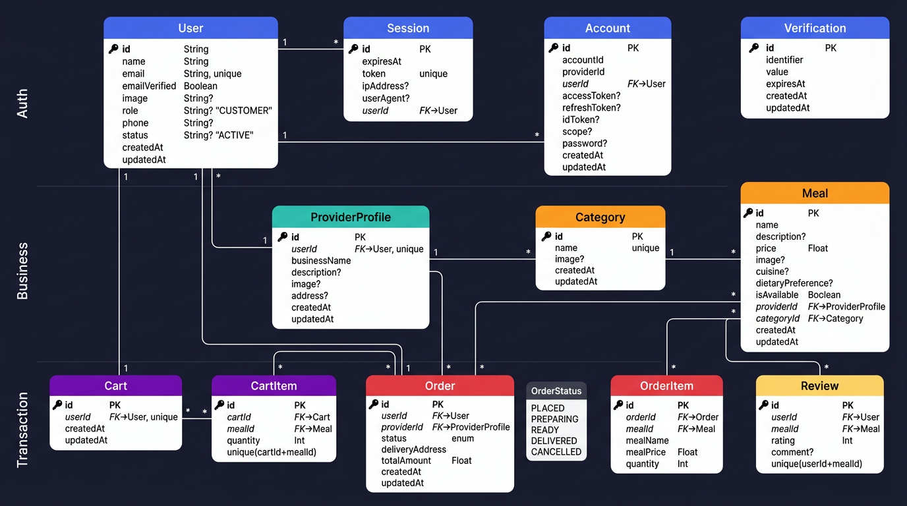

# FoodHub API

A robust RESTful API built for a food delivery platform, facilitating interactions between Customers, Food Providers (Restaurants), and Administrators.

## 🚀 Tech Stack

- **Runtime Environment:** [Node.js](https://nodejs.org/)
- **Framework:** [Express.js](https://expressjs.com/)
- **Language:** [TypeScript](https://www.typescriptlang.org/)
- **ORM:** [Prisma](https://www.prisma.io/)
- **Database:** [PostgreSQL](https://www.postgresql.org/)
- **Authentication:** [Better Auth](https://better-auth.com/)

---

## 📊 Database ER Diagram



---

## ✨ Features

### Authentication & Authorization

- Secure JWT-based authentication using Better Auth
- Role-based access control (`CUSTOMER`, `PROVIDER`, `ADMIN`)
- Registration and Login workflows
- Session & Profile management

### Users & Roles

- **Customers:** Browse meals, manage cart, place orders, and leave reviews.
- **Providers:** Manage restaurant profiles, create and update meal menus, and process incoming orders.
- **Admins:** Global dashboard to manage users (suspend/activate), food categories, and oversee all platform orders.

### Platform Capabilities

- **Categories:** Dynamic food category and cuisine management.
- **Meals:** Comprehensive meal CRUD operations with filtering capabilities (cuisine, dietary preference, price).
- **Cart & Checkout:** Add/remove items from the cart and seamless checkout processing.
- **Order Tracking:** Real-time order status updates (`PLACED` ➔ `PREPARING` ➔ `READY` ➔ `DELIVERED` / `CANCELLED`).
- **Reviews:** Customers can leave ratings and reviews for meals.

---

## 🛠️ Quick Start & Local Setup

### Prerequisites

Make sure you have installed on your local machine:

- [Node.js](https://nodejs.org/) (v18+ recommended)
- [PostgreSQL](https://www.postgresql.org/)

### Installation

1. **Install dependencies:**

   ```bash
   npm install
   ```

2. **Environment Variables:**
   Copy the example `.env` file and configure your database and authentication secrets.

   ```bash
   cp .env.example .env
   ```

   _Make sure to update `DATABASE_URL` and `BETTER_AUTH_SECRET` inside the `.env` file._

3. **Database Setup:**
   Generate the Prisma client and push the schema to your database.

   ```bash
   npx prisma generate
   npx prisma migrate dev
   ```

   or

   ```bash
   npx prisma generate
   npx prisma db push
   ```

4. **Start the Development Server:**

   ```bash
   npm run dev
   ```

   The API will typically be accessible at `http://localhost:5000` (or as configured via `PORT` in your `.env`).

---

## 🔐 Default Login Credentials

Seed scripts create default users for testing. **The API server must be running first** (otherwise you'll get `ECONNREFUSED`).

```bash
# Start the API server (in one terminal)
npm run dev

# Then run seeds (in another terminal)
# Option A: Reset and create ALL users (admin + customer + providers) - use this if credentials don't work
npm run seed

# Option B: Run seeds separately
npm run seed:admin    # Create admin first
npm run seed:data     # Create customer, providers, categories, meals, orders
```

To reset users when login fails ("Invalid password"):

```bash
# Reset ALL users (admin + customer + providers) - recommended
npm run seed

# Or reset individually:
npm run seed:admin -- --reset   # Admin only
npm run seed:data -- --reset    # Customer and providers only
```

| Role     | Email                | Password    |
| -------- | -------------------- | ----------- |
| Admin    | admin@foodhub.com    | admin1234   |
| Customer | customer@foodhub.com | customer123 |
| Provider | maria@foodhub.com    | provider123 |
| Provider | joe@foodhub.com      | provider123 |

### Troubleshooting: Login not working from frontend

1. **Set environment variables** so the frontend can reach the API and auth works:

   **Client** (`client/code/.env`):

   ```
   NEXT_PUBLIC_API_URL=http://localhost:5000
   ```

   ⚠️ **Important:** The port must match your API server (default 5000). If your client `.env` has `5001` or another port, login will fail.

   **API** (`api/code/.env`):

   ```
   PORT=5000
   BETTER_AUTH_URL=http://localhost:5000
   APP_URL=http://localhost:3000
   ```

2. **Start both servers** – API on port 5000, client on port 3000.

3. **Run seeds with the API running** – `seed:admin` then `seed:data`.

4. If you still get "Invalid password", run `npm run seed` to reset and recreate all users with correct credentials.

---

## 📖 API Documentation Structure

_Detailed endpoint documentation can be found in `api/docs/features.md`, but general route patterns include:_

- **`/api/auth/*`** — Authentication routes (login, register, me)
- **`/api/meals/*`** — Public meal listings and filters
- **`/api/providers/*`** — Public provider profiles and menus
- **`/api/orders/*`** — Customer order management
- **`/api/provider/*`** — Private routes for providers to manage their menus and orders
- **`/api/admin/*`** — Private routes for global portal administration
